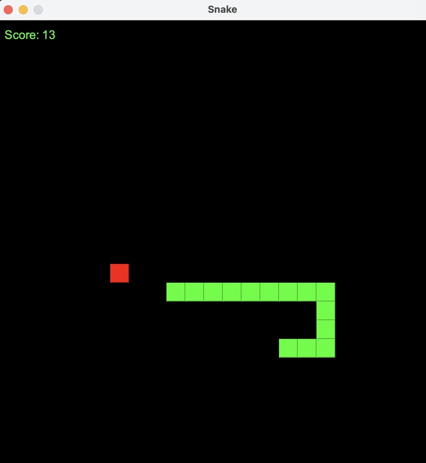

## Snake

This is a Snake game made entirely with java, using the java.swing GUI.

# Description

Game is within a 600x600 pixel window where arrow keys control movement of the snake.
A food item will appear for which goal is for snake to eat the food by using arrow keys to move snake towards it.
If snake hits edge of window or itself, the game is over.
For each food item consumed, score is incremented by 1.

# Instructions

Clone repository to local machine using Git.

Launch VS Code and Navigate to the project.

Build the project using `javac -d bin src/*.java`.

Run the project.
